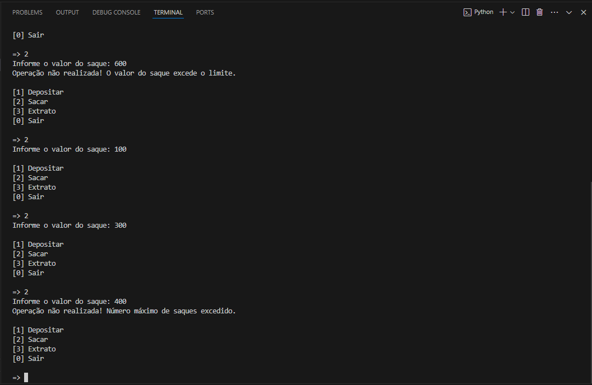

# Criando-Sistema-Bancário-com-Python

Neste projeto irei descrever a criação de um código em Python, com entrada de dados e saída no terminal, de acordo com o padrão especificado no desafio de projeto logo abaixo.

- Curso: Python Development
- Instrutor: Guilherme Arthur de Carvalho
- Instituição: [DIO.me](https://www.dio.me/)

## Desafio

### Objetivo:

O desafio consiste em um sistema bancário simplificado, com comandos para depósito, saque, extrato e saida.
Algumas condições são imperativas, sendo definidas pelo sistema do banco:

- Valor máximo por saque: R$ 500,00
- Quantidade máxima de saques por dia: 3 saques.
- Limite de cheque especial: R$ 0,00

### Operações:

O sistema deve listar todos os depósitos e saques realizados na conta. No fim da listagem deve ser exibido o saldo atual da conta. Se o extrato estiver em branco, exibir a mensagem: __"Não foram realizadas movimentações"__.

## Criando Repositório

Primeiramente criei o repositório no __GitHub__ com nome __"criando-sistema-bancario-com-python"__ e clonei o repositório para meu PC utilizando o __GitHub Desktop__.

## Abrindo Visual Studio Code

Para este projeto, mais uma vez eu utilizei o __VS Code da Microsoft__, que é gratuito e fácil de usar.

## Criando o Projeto

Após __VS Code__ aberto, criei a criei o arquivo __"desafio.py"__, aonde irei criar o código em __Python__.

## Código

- Inicialmente criei uma mensagem de boas vindas e em seguida, apresentei o menu com as opções de seleção disponíveis ao usuário. Por último declarei as variáveis e uma constante que serão utlizados ao longo do código. Trecho do código abaixo:

```
boas_vindas = """
BEM VINDO AO BANCO TORRES!

Favor selecionar uma opção abaixo:
"""
print(boas_vindas)

menu = """         
[1] Depositar
[2] Sacar
[3] Extrato
[0] Sair

=> """

saldo = 0
limite = 500
extrato = ""
numero_saques = 0
LIMITE_SAQUES = 3
```

- Loop principal é iniciado testando os comandos inseridos pelo usuário e implementando a lógica de acordo com a opção escolhida. Nesta estrutura de repetição ocorre toda as lógicas para que código funcione corretamente.

```
while True:

    opcao = input(menu) 

    if opcao == "1":
        valor = float(input("Informe o valor do deposito: "))

        if valor > 0:
            saldo += valor
            extrato += f"Deposito: R$ {valor:.2f}\n"

        else:
            print("Operação não realizada! O valor informado é inválido.")

    elif opcao == "2":      
        valor = float(input("Informe o valor do saque: "))

        #Verifica se o valor excede o saldo, o limite ou o número máximo de saques.
        excedeu_saldo = valor > saldo

        excedeu_limite = valor > limite

        excedeu_saques = numero_saques >= LIMITE_SAQUES

        if excedeu_saldo:
            print("Operação não realizada! Você não tem saldo suficiente.")

        elif excedeu_limite:
            print("Operação não realizada! O valor do saque excede o limite.")

        elif excedeu_saques:
            print("Operação não realizada! Número máximo de saques excedido.")

        elif valor > 0:
            saldo -= valor
            extrato += f"Saque: R$ {valor:.2f}\n"
            numero_saques += 1

        else:
            print("Operação não realizada! O valor informado é inválido.")
    
    elif opcao == "3":
        print("\n================ EXTRATO ================")
        print("Não foram realizadas movimentações." if not extrato else extrato)
        print(f"\nSaldo: R$ {saldo:.2f}")
        print("==========================================")

    
    elif opcao == "0":
        print("Obrigado por utilizar nossos serviços!0")
        print("Tenha um bom dia!")
        break

    else:
        print("Operação inválida, por favor selecione novamente a operação desejada.")
```

## Testando Código

- Neste 1º teste verifiquei se a lógica estava correta e para isso, selecionei primeriramente a opção "1" e inserindo um deposito de R$2000,00, logo após pedi para realizar um saque, selecionando a opção "2" e inserindo o valor de R$500,00. Na terceira etapa do teste selecionei a opção 3 e o extrato foi exibido. No final do teste selecionei a opção "0" para apresentação de mensagem de agradecimento e finalização do código. Resultado do teste apresentado na imagem abaixo:


- Também fiz um 2º teste explorando as condições de valores maiores que o determinado e excesso de saques, com o código se comportando da maneira esperada conforme imagem abaixo:



## Conclusão

Este foi o meu primeiro projeto de __Liguagem Python__ e fiquei muito feliz com o resultado. Como foi o primeiro projeto, tive muita ajuda do instrutor e consegui fixar mais os conhecimentos aprendidos neste módulo.

## Linguagens de Marcação e Programação

- 

- 

## Ferramentas e Serviços

- 

- 

- 